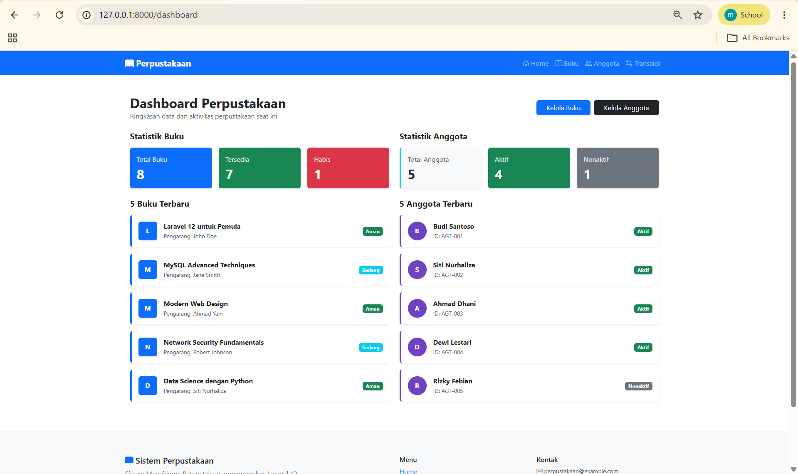
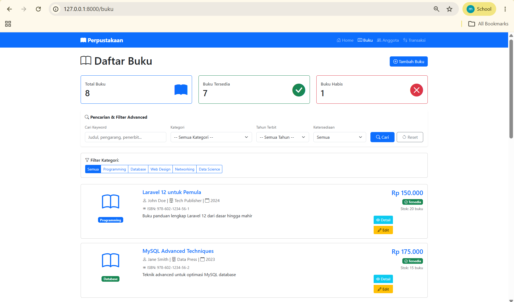
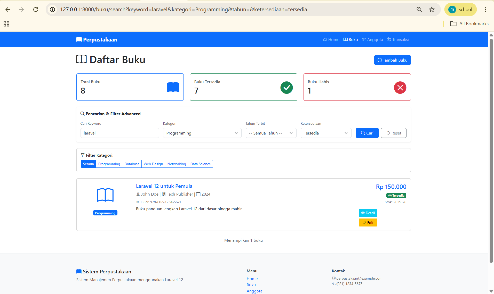

# Tugas Pemrograman Web Pertemuan 11

## Identitas
- Nama: Muhammad Hamdi Yahya
- NIM: 60324035
- Kelas: B
- Mata Kuliah: Pemorgraman Web 2

---

# Tugas yang dibuat

## Tugas 1 - Halaman Dashboard (30%)
- Membuat `DashboardController` dengan method `index()`
- Route: `/dashboard`
- Menampilkan statistik: total buku, buku tersedia, buku habis
- Menampilkan statistik: total anggota, anggota aktif, anggota nonaktif
- Menampilkan list 5 buku terbaru dan 5 anggota terbaru
- Quick links ke menu utama (Kelola Buku & Kelola Anggota)

## Tugas 2 - Blade Component Card Buku (40%)
- Membuat Blade Component `BukuCard` menggunakan `php artisan make:component BukuCard`
- Properties: `$buku` (object) dan `$showActions` (boolean, default true)
- Menampilkan: cover icon, judul, pengarang, harga, stok
- Badge kategori dan status ketersediaan
- Button actions (Detail, Edit) jika `$showActions = true`

## Tugas 3 - Search & Filter Buku Advanced (30%)
- Membuat method `search()` di `BukuController`
- Route: `/buku/search`
- Input keyword (search judul, pengarang, penerbit)
- Filter kategori (dropdown)
- Filter tahun (dropdown)
- Filter ketersediaan (Semua/Tersedia/Habis)

---

# Screenshot Hasil

> Semua screenshot disimpan di folder `image/`

## 1. Halaman Dashboard
Menampilkan ringkasan statistik perpustakaan beserta data terbaru.

---

## 2. Halaman Daftar Buku dengan Form Search & Filter
Menampilkan form pencarian dan filter advanced pada halaman daftar buku.

---

## 3. Hasil Pencarian/Filter
Menampilkan hasil setelah melakukan pencarian atau filter data buku.

---
