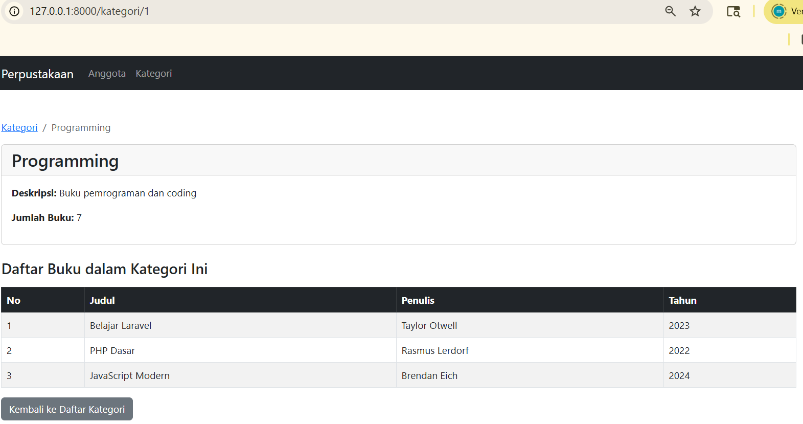
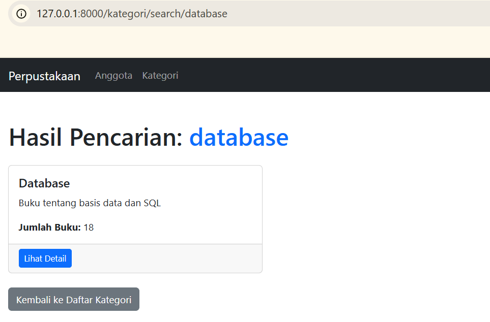

# Tugas Pemrograman Web Pertemuan 13

## Identitas
- Nama: Muhammad Hamdi Yahya
- NIM: 60324035
- Kelas: B
- Mata Kuliah: Pemorgraman Web 2

---

# Tugas yang dibuat

## Tugas 1 - Auto-Generate Kode Anggota (30%)
- Implementasi auto-generate kode anggota dengan format: `AGT-[TAHUN]-[NOMOR_URUT]`
- Contoh: AGT-2026-001, AGT-2026-002, AGT-2026-003
- Helper function `generateKodeAnggota()` di `AnggotaController`
- Nomor urut otomatis di-reset setiap pergantian tahun
- Input kode anggota menjadi `readonly` (tidak bisa diedit manual)
- Kode dikirim dari method `create()` ke view menggunakan `compact`

## Tugas 2 - Export Anggota ke Excel (40%)
- Implementasi fitur export data anggota ke file Excel (.xlsx)
- Menggunakan package `maatwebsite/excel` (Laravel Excel)
- Membuat Export Class `AnggotaExport` dengan `FromCollection` dan `WithHeadings`
- Data yang diexport: Kode, Nama, Email, Telepon, Alamat, Tanggal Lahir, Jenis Kelamin, Pekerjaan, Status, Tanggal Daftar
- Nama file otomatis dengan timestamp: `anggota_YYYY-MM-DD_HHmmss.xlsx`
- Tombol "Export Excel" pada halaman daftar anggota
- Method `export()` di `AnggotaController`
- Route: `GET /anggota/export`

## Tugas 3 - Advanced Search & Filter (30%)
- Fitur pencarian dan filter advanced untuk data anggota
- Filter berdasarkan keyword (nama, email, telepon)
- Filter berdasarkan jenis kelamin (Laki-laki / Perempuan)
- Filter berdasarkan status (Aktif / Nonaktif)
- Filter berdasarkan pekerjaan (Mahasiswa / Pegawai / Wiraswasta)
- Statistik otomatis menyesuaikan hasil pencarian
- Tombol reset untuk menghapus semua filter
- Method `search()` di `AnggotaController`
- Route: `GET /anggota/search`

---

# Screenshot Hasil

> Semua screenshot disimpan di folder `image/`

## 1. Form Tambah Anggota - Kode Otomatis
Menampilkan form tambah anggota dengan kode anggota yang di-generate otomatis (readonly).

---

## 2. Tombol Export Excel
Menampilkan tombol Export Excel pada halaman daftar anggota.

---

## 3. Hasil File Excel
Menampilkan isi file Excel (.xlsx) yang berhasil diexport dengan data anggota.

---

## 4. Form Search & Filter Advanced
Menampilkan form pencarian dan filter advanced pada halaman daftar anggota.

---

## 5. Hasil Pencarian 
Menampilkan hasil pencarian anggota berdasarkan keyword nama/email/telepon.

---
